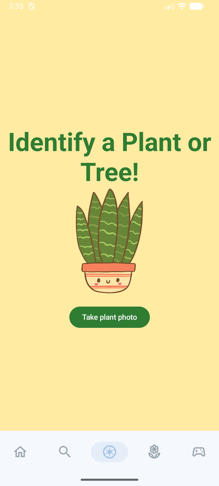
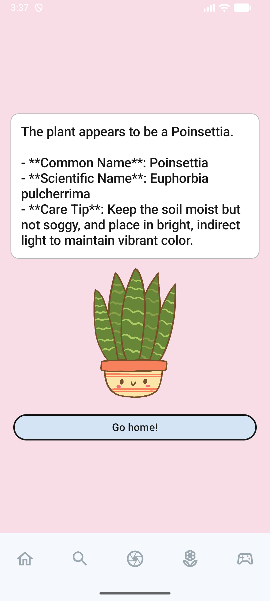

  

<h1 align="center"><b>LeafLens</b></h1>

  A full-stack mobile app for learning about botany!

  

## 🌿 Main Features

### Botany Study Guide 

### Educational Plant Game 

### Real-Time AI Plant Identifier

### Trading Cards with Animations

## 📚 Table of Contents
- [💬 Introduction](#-introduction)
- [🚀 Features](#-features)
- [▶️ Pictures](#-pictures)
- [🧰 Tech Stack](#-tech-stack)
- [🛠️ Installation](#-installation)
- [🧪 Usage](#-usage)
- [❓FAQ](#faq)
- [📄 Documentation](#documentation)
- [🙏 Acknowledgments](#-acknowledgments)

## 💬 Introduction

LeafLens is an innovative mobile application designed to educate users about botany through interactive features. The app includes an educational plant game, a comprehensive botany study guide, a real-time AI plant tutor, and animated trading cards. It was built using Kotlin and JetPack Compose for the frontend, Firebase for authentication and database management, and OpenAI's API for AI functionalities.

## 🚀 Features

### Account Creation and Authentication
1. Users can create an account using email and password.
2. Firebase Authentication is used to manage user accounts securely.

### Educational Plant Game
1. Click into the plant game in the bottom navigation bar
2. Two different levels: easy and hard.
3. Each game has 4 commands: move up, move down, move left, move right
4. Audio playback and sound effects.
5. Drag and drop
6. Handling success and reattempt
7. Creating sessions for the game players
8. Works on phone and tablets
9. Cartoon graphics and sound bubbles

[Watch Educational Plant Game Video](https://youtu.be/wsfKHGA955Q)

### Botany Study Guide
1. Click into different sections to learn about botany
2. Learn about gardening tips
3. Horticulture
4. Plant Anatomy
5. Plant Chemistry
6. Plant History 
7. Plant Physiology

### Real-Time AI Plant Tutor
1. Take pictures of plants using the camera 
2. Image gets sent to OpenAI's API using the ChatGPT 4o Vision model
3. Receive detailed information about the plant in real-time including the plant's name, species, and care instructions.

### Trading Cards with Animations
1. Collect trading cards of different plants
2. Each card has unique animations

## ▶️ Pictures
### Splash Screen/ Login / Register with Firebase

### Educational Plant Game

### OpenAI Plant Identifier

### Plant Trading Cards with Animations

  

### Botany Study Guide

## 🧰 Tech Stack
1. Android Studio
2. Kotlin
3. JetPack Compose
4. Firebase Authentication
6. OpenAI API (ChatGPT 4o Vision model)
7. CameraX API
8. HTTP Client (OkHttp)
9. Animation Libraries

## 🛠️ Installation
1. Clone the repository
2. Open the project in Android Studio.
3. Firebase Private Key included
4. Set up OpenAI API key in the project.
5. Build and run the application on an Android device or emulator.
6. Enjoy learning about botany with LeafLens!

## ❓FAQ
1. **What platforms does LeafLens support?**
   - LeafLens is currently available for Android devices.
2. **Is there a cost to use LeafLens?**
   - LeafLens is free to download and use.
3. **Is user data secure?**
   - Yes, LeafLens uses Firebase Authentication to ensure user data is securely managed.

## 📄Documentation
[View the Documentation ???Insert Documentation](https://google.com)

## 🙏 Acknowledgments
- Special thanks to **Dr. Moaath Alrajab** for his guidance and support throughout the development of this project.

